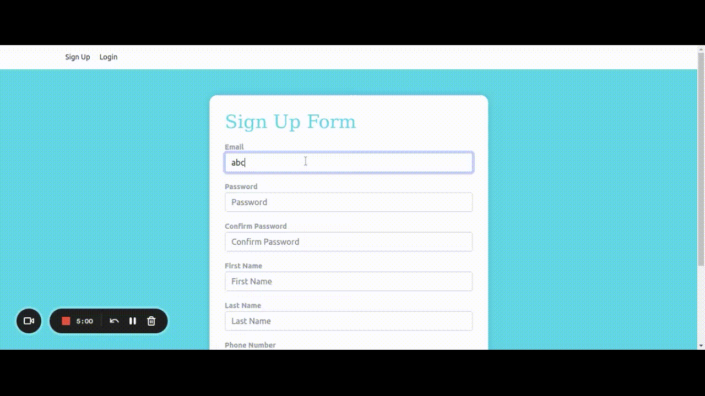

# Tipaw tech challenge

In this project we have used following dependencies

- [x] node
- [x] typescript
- [x] Apollo server
- [x] prisma
- [x] cors
- [x] eslint
- [x] jest
- [x] Cors
- [x] dotenv
- [x] bcryptjs
- [x] pg
- [x] Apollo Client
- [x] NEXT JS
- [x] Bootstrap
- [x] EmotionCSS


## ✨ Bonus points covered

- ✅ Server side rendering (even though not useless here, we are curious to see how you would do it) 
- ✅ Using GraphQL + Prisma + PostgresQL for the backend 
- ✅ Automated tests 
- ✅ A way for users to login (session management) 
- Building a design system for the UI components
- ✅ A clear project architecture 
- Deploy the applications 

## Install PostgreSQL

https://www.postgresql.org/download/


## Install Dependencies

```
npm run getpkg
```
## Start App

```
npm start
```

## Testing

```
npm run test
```

### Server testing

```
npm run test-server
```
### Client automation testing

```
npm run test-client
```




## Postman collection :

```
File available in root directory with name (Fantastic_engine.postman_collection.json)
```

